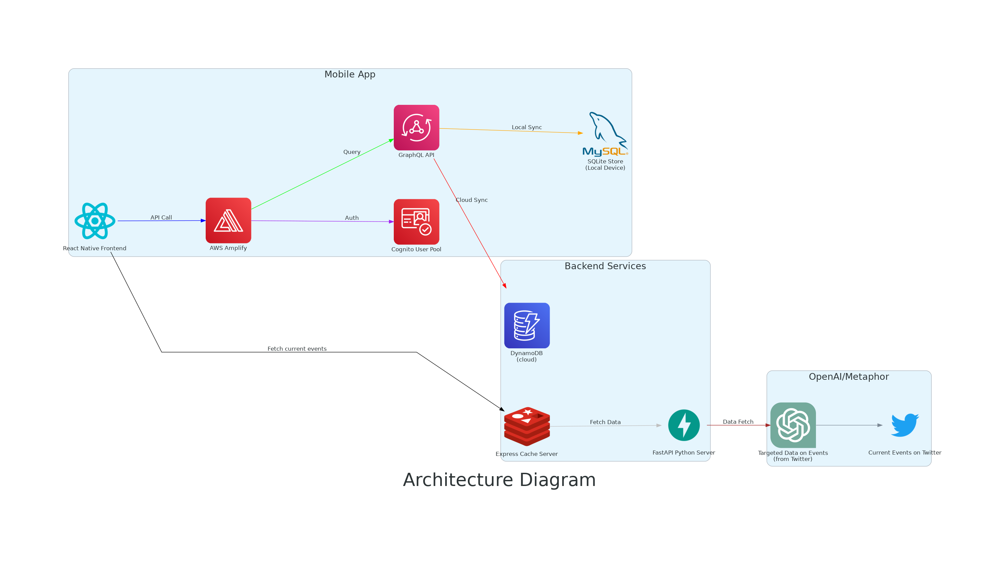

# WhatsGoingOn

WhatsGoingOn is a React Native app that helps users find current events happening in their area using LLMs.

Backend Here: https://github.com/John42506176Linux/WhatsGoingOn-BackEnd

(This project originally started using expo, but was updated to use the CLI, see the original project here https://github.com/John42506176Linux/WhatsGoingOn-FrontEnd.git)

## Architecture

Here is an overview of the architecture of the application:

## Installation

To set up the app using React Native CLI, follow these steps:

1. Clone the repository:

git clone https://github.com/John42506176Linux/WhatsGoing-FrontEndNative

2. Navigate to the project directory:

cd WhatsGoingOn-FrontEndNative

3. Install the dependencies:

npm install

4. Start the app:

- For iOS:

react-native run-ios

- For Android:

react-native run-android

This will start the Metro bundler and run the app on your device or emulator.

## Usage

To use the app:

1. Open the app on your device or emulator.
2. Allow the app to access your location.
3. You should see a list of events happening in your area.
4. Click on an event to view more details about it.
5. Save interesting events to go back to later.
6. Leave a star on the repo, to show some appreciation :)

## Contributing

If you'd like to contribute to this project, please submit a pull request or open an issue.

## License

This project is licensed under the MIT License. Refer to the LICENSE file for more details.
